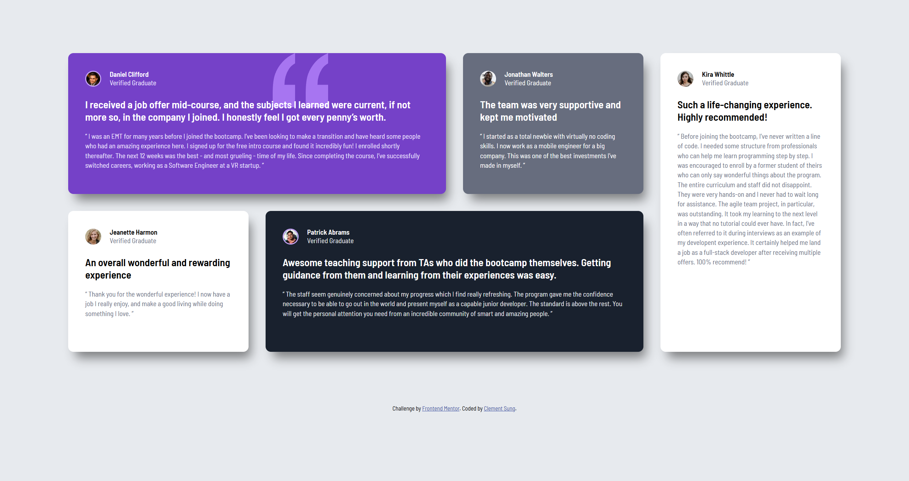

# Frontend Mentor - Testimonials grid section solution

This is a solution to the [Testimonials grid section challenge on Frontend Mentor](https://www.frontendmentor.io/challenges/testimonials-grid-section-Nnw6J7Un7). Frontend Mentor challenges help you improve your coding skills by building realistic projects. 

## Table of contents

- [Overview](#overview)
  - [The challenge](#the-challenge)
  - [Screenshot](#screenshot)
  - [Links](#links)
- [My process](#my-process)
  - [Built with](#built-with)
  - [What I learned](#what-i-learned)
  - [Continued development](#continued-development)
  - [Useful resources](#useful-resources)
- [Author](#author)

## Overview

### The challenge

Users should be able to:

- View the optimal layout for the site depending on their device's screen size

### Screenshot




### Links

- Solution URL: [Solution URL](https://clembrulee.github.io/testimonial-grid/)
- Live Site URL: [Testimonial Grid](https://your-live-site-url.com)

## My process

### Built with

- Semantic HTML5 markup
- CSS custom properties
- Flexbox
- CSS Grid
- Mobile-first workflow


### What I learned

I learned how to use CSS grid to create the layout of the testimonials.


```css
@media screen and (min-width: 426px) and (max-width: 768px) {
  main {
    display: grid;
    grid-template-columns: repeat(2, minmax(200px, 1fr));
    grid-template-rows: repeat(2, minmax(250px, 1fr));
    gap: 32px;
  }
}

@media (min-width: 769px) {
  main {
    display: grid;
    grid-template-columns: repeat(4, minmax(200px, 1fr));
    grid-template-rows: repeat(2, minmax(250px, 1fr));
    gap: 32px;
    margin: 100px auto;
    
  }
```


### Continued development

Continue to learn more CSS layout techniques for efficient and responsive design.


### Useful resources

- [CSS Tricks Grid Layout Guide](https://css-tricks.com/snippets/css/complete-guide-grid/) - This layout guide helped me understand the grid template 


## Author

- Website - [Clement Sung](https://github.com/clembrulee/)
- Frontend Mentor - [@clembrulee](https://www.frontendmentor.io/profile/clembrulee)
